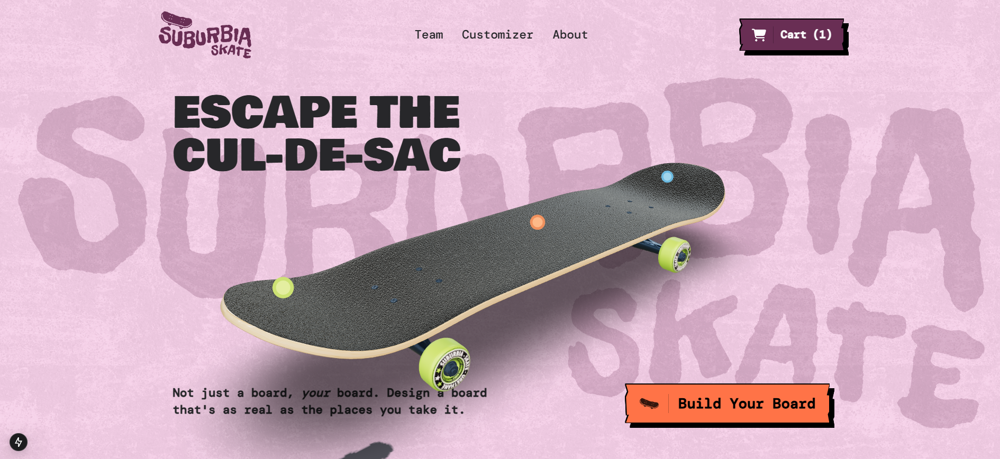

# 🛹 Suburbia Skateboards - 3D Skateboard Customizer

A cutting-edge web application that lets skateboarding enthusiasts customize their dream boards in real-time 3D. Built with Next.js 15 and Three.js for an immersive customization experience.

## ✨ Features

- Interactive 3D skateboard customizer with real-time updates
- Smooth animations powered by GSAP
- Dynamic content management through Prismic CMS
- Responsive design with Tailwind CSS
- Type-safe development with TypeScript
- SEO-optimized landing page
- High-performance and mobile-friendly

## 🚀 Tech Stack

- **Framework:** Next.js 15
- **3D Rendering:** Three.js with React Three Fiber
- **Styling:** Tailwind CSS
- **Animations:** GSAP
- **Language:** TypeScript
- **Hosting:** Netlify

## 🎨 Customization Features

- Deck designs and patterns
- Truck colors and materials
- Wheel customization
- Grip tape patterns
- Real-time price updates
- Save and share custom designs

## 🔑 Key Implementation Details

- Server-side rendering for optimal performance
- Dynamic routes for shareable custom designs
- Responsive 3D viewer with touch controls
- Optimized 3D models for web performance
- Custom hooks for state management
- Reusable animation components

## 📱 Responsive Design

The application is fully responsive and works seamlessly across:
- Desktop browsers
- Tablets
- Mobile devices
- Different screen orientations

## 🤝 Contributing

Contributions are welcome! Please feel free to submit a Pull Request.

1. Fork the repository
2. Create your feature branch (`git checkout -b feature/AmazingFeature`)
3. Commit your changes (`git commit -m 'Add some AmazingFeature'`)
4. Push to the branch (`git push origin feature/AmazingFeature`)
5. Open a Pull Request

## 🙏 Acknowledgments

- Three.js community for 3D rendering resources
- Prismic team for CMS support
- Next.js team for the amazing framework
- All contributors who helped improve this project

## 📈 Future Roadmap

- [ ] Add AR preview functionality
- [ ] Implement social sharing features
- [ ] Add more customization options
- [ ] Create a mobile app version
- [ ] Add user authentication
- [ ] Implement order management system

## ⚡ Performance

The application has been optimized for:
- Quick initial load times
- Smooth 3D interactions
- Efficient asset loading
- Minimal bundle size
- Optimal caching strategies

---

*Built with ❤️ by Asad Raza*